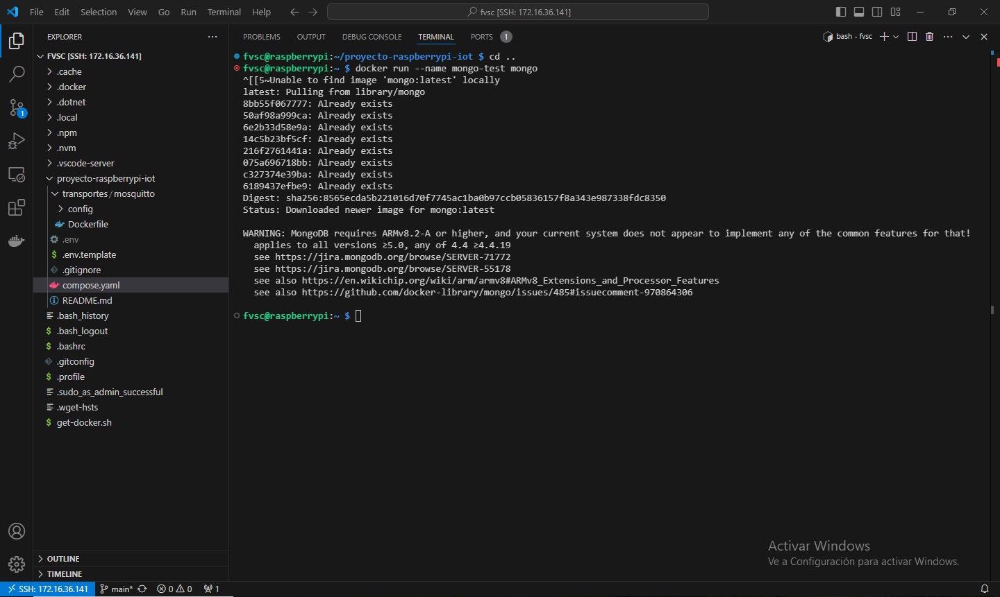
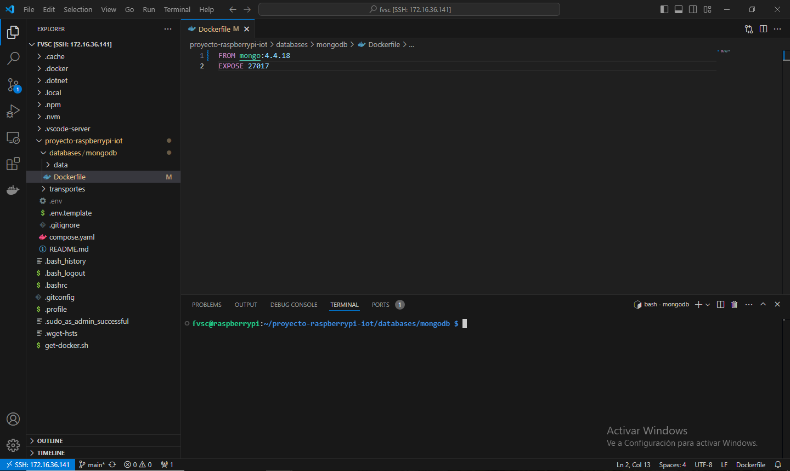
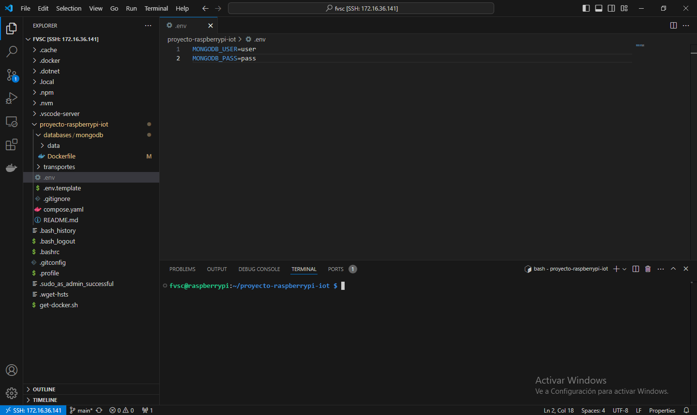
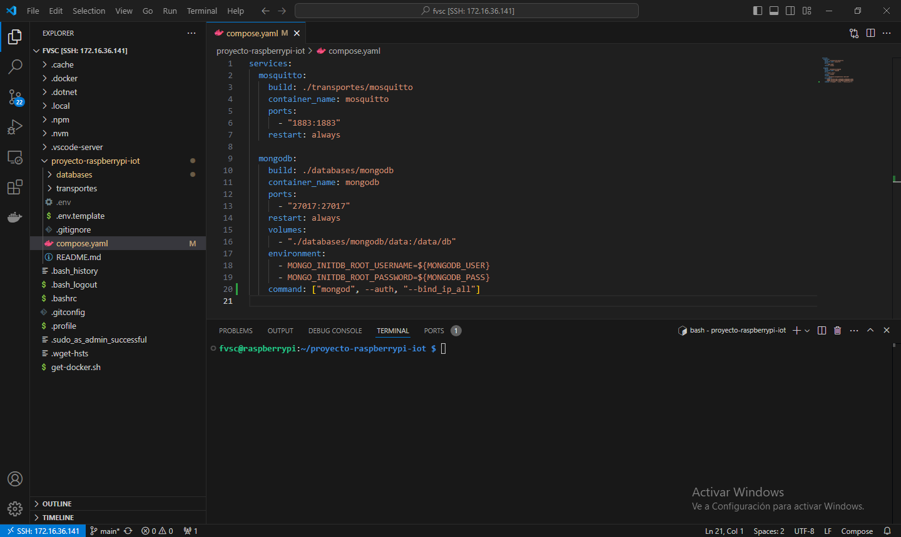
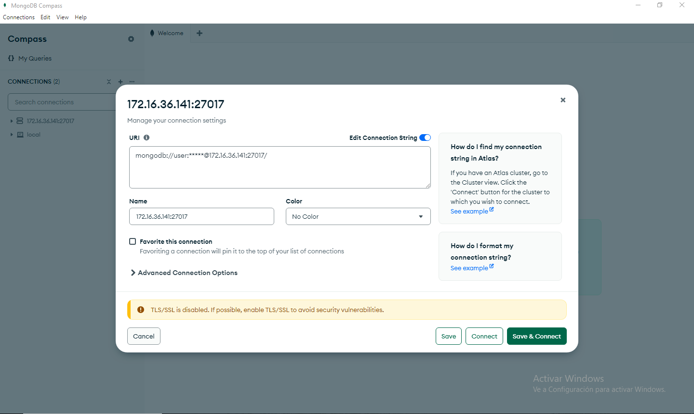
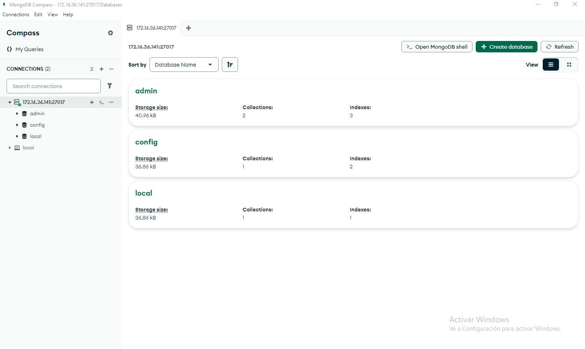

# Capítulo 10: MongoDB con Docker en la Raspberry Pi

## Obtener la última versión de MongoDB que es compatible con nuestra Raspberry Pi

1. Abrir la terminal de la Raspberry Pi desde Visual Studio Code.
2. Ejecutar `docker run --name mongo-test mongo`.

📝Podemos instalar cualquier versión 4.4.X donde X sea menor a 19.

3. Ejecutar `docker rm mongo-test`.
4. Ejecutar `docker rmi mongo:latest`.

## Crear el archivo Dockerfile para MongoDB

1. Ejecutar `cd proyecto-raspberrypi-iot`.
2. Ejecutar `mkdir databases`.
3. Ejecutar `cd databases`.
4. Ejecutar `mkdir mongodb`.
5. Ejecutar `cd mongodb`.
6. Ejecutar `mkdir data`.
7. Ejecutar `touch Dockerfile`.
8. Ver el sistema de archivos de la Raspberry Pi desde Visual Studio Code.
9. Modificar el contenido del `Dockerfile`:

📦[mongo](https://hub.docker.com/_/mongo/).

## Crear el archivo .env con las variables de entorno de Docker

1. Ejecutar `cd ..`.
2. Ejecutar `cd ..`.
3. Ejecutar `touch .env`.
4. Modificar el contenido de `.env`:

5. Crear una copia de `.env` llamada `.env.template`.

📝[Set environment variables within your container's environment](https://docs.docker.com/compose/how-tos/environment-variables/set-environment-variables/).

## Modificar el archivo compose.yaml de Docker

1. Abrir el archivo `compose.yaml`.
2. Modificar el contenido de `compose.yaml`:

## Prueba de conexión con MongoDB Compass desde nuestra PC

1. Instalar [MongoDB Compass](https://www.mongodb.com/try/download/compass).

