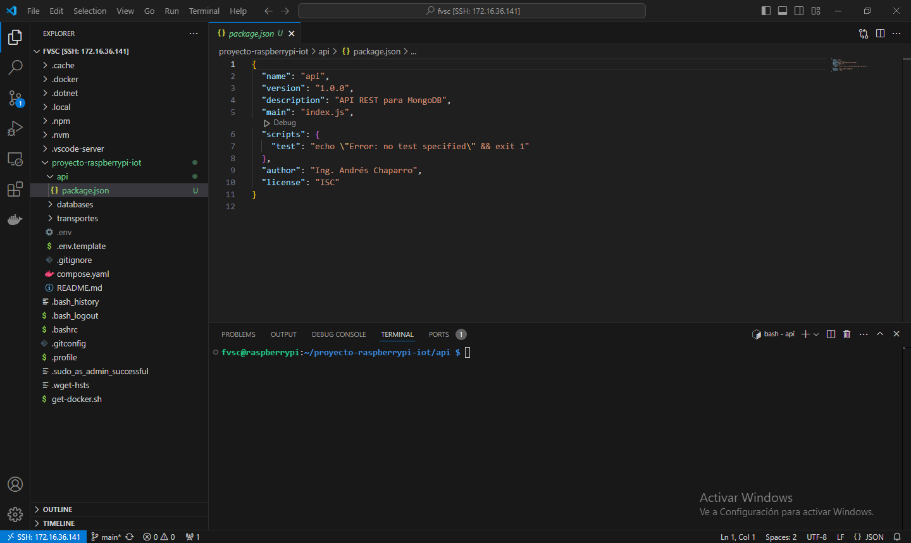
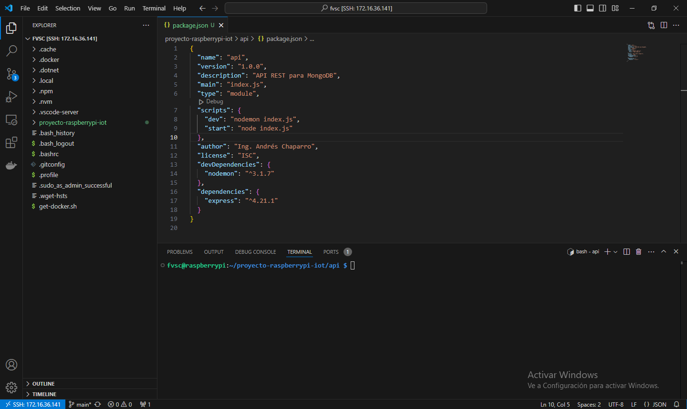
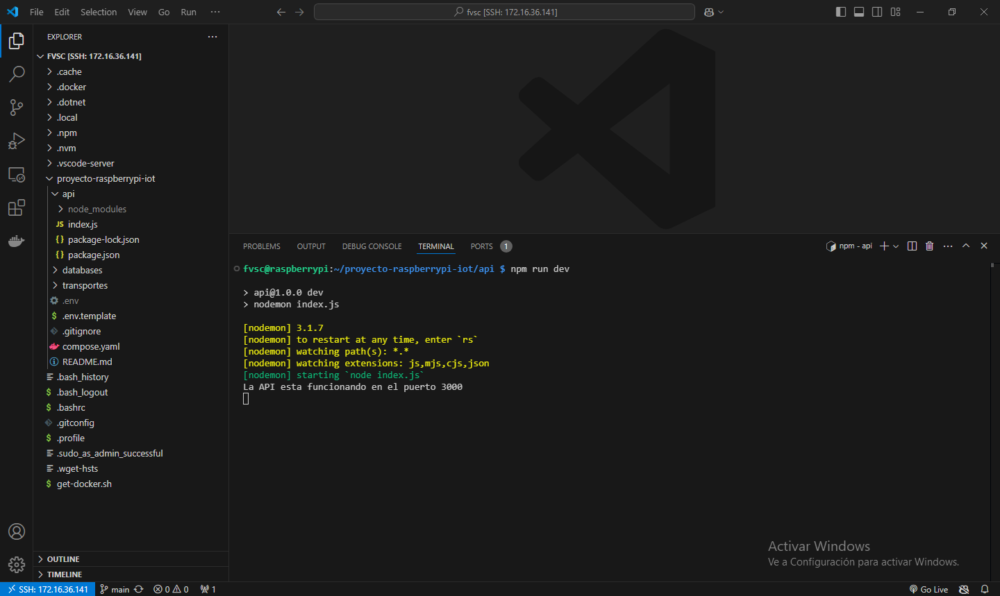
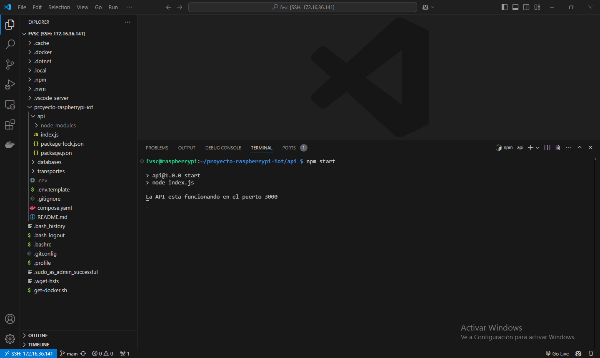
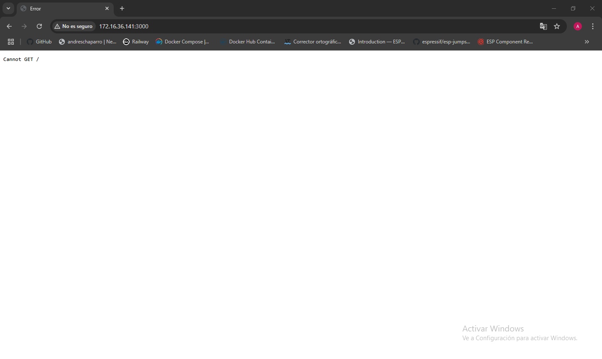

# Capítulo 11: Node y Express en la Raspberry Pi

## Crear el archivo package.json

1. Abrir la terminal de la Raspberry Pi desde Visual Studio Code.
2. Ejecutar `cd proyecto-raspberrypi-iot`.
3. Ejecutar `mkdir api`.
4. Ejecutar `cd api`.
5. Ejecutar `npm init`.
6. No modificar el `package name` y presionar `ENTER`.
7. No modificar la `version` y presionar `ENTER`.
8. Ingresar `API REST para MongoDB` como `description` y presionar `ENTER`.
9. No modificar el `entry point` y presionar `ENTER`.
10. No modificar el `test command` y presionar `ENTER`.
11. No modificar el `git repository` y presionar `ENTER`.
12. No modificar las `keywords` y presionar `ENTER`.
13. Ingresar nuestro nombre como `author`y presionar `ENTER`.
14. No modificar la `license` y presionar `ENTER`.
15. Presionar `ENTER`.



## Instalar las dependencias de desarrollo

1. Ejecutar `npm install --save-dev nodemon`.

📝[nodemon](https://www.npmjs.com/package/nodemon).

## Instalar las dependencias de producción

1. Ejecutar `npm install express`.

📝[express](https://www.npmjs.com/package/express).

## Crear el entry point

1. Ejecutar `touch index.js`.
2. Ver el sistema de archivos de la Raspberry Pi desde Visual Studio Code.
3. Abrir el archivo `index.js`.
4. Modificar el contenido del `index.js`:

```
import express from "express"

const app = express()
const port = 3000

app.listen(port, ()=> {
    console.log(`La API esta funcionando en el puerto ${port}`)
})
```

## Modificar los scripts de Node

1. Abrir el archivo `package.json`.
2. Eliminar el script llamado `test`.
3. Agregar un script llamado `dev` que ejecute `nodemon index.js`.
4. Agregar un script llamado `start` que ejecute `node index.js`.

## Habilitar la sintaxis ES6

1. Abrir el archivo `package.json`.
2. Agregar el atributo llamado `type` con el valor `module`.



## Ejecutar Node en modo desarrollo

1. Ejecutar `npm run dev`.



## Ejecutar Node en modo producción

1. Ejecutar `npm start`.



## Prueba de funcionamiento de Node y Express desde nuestra PC

1. Ejecutar node en modo desarrollo o producción.
2. Abrir el navegador [Google Chrome](https://www.google.com/chrome).
3. Ingresar la dirección: `http://XXX.XXX.XXX.XXX:3000`. Donde `XXX.XXX.XXX.XXX` es la dirección IP de la Raspberry Pi.


