# Capítulo 12: Manejo de rutas en Express

## Crear un archivo JS para cada grupo de rutas

1. Abrir la terminal de la Raspberry Pi desde Visual Studio Code.
2. Ejecutar `cd proyecto-raspberrypi-iot`.
3. Ejecutar `cd api`.
4. Ejecutar `mkdir routes`.
5. Ejecutar `cd routes`.
6. Ejecutar `touch device.routes.js`.
7. Ejecutar `touch telemetry.routes.js`.
8. Ejecutar `touch action.routes.js`.

## Crear las rutas en device.routes.js

1. Ver el sistema de archivos de la Raspberry Pi desde Visual Studio Code.
2. Abrir el archivo `device.routes.js`.
3. Modificar el contenido del `device.routes.js`:

```
import { Router } from "express"

export const deviceRouter = Router()

deviceRouter.get("/", (req, res) => {
    console.log("Llama a getAllDevices")
    res.status(200).send("Devuelve todos los dispositivos")
})

deviceRouter.get("/:id", (req, res) => {
    console.log(`Llama a getDeviceById con el id ${req.params.id}`)
    res.status(200).send("Devuelve un dispositivo")
})

deviceRouter.post("/", (req, res) => {
    console.log("Llama a createDevice")
    res.status(201).send("Registra un dispositivo")
})
```

## Crear las rutas en telemetry.routes.js

1. Abrir el archivo `telemetry.routes.js`.
2. Modificar el contenido del `telemetry.routes.js`:

```
import { Router } from "express"

export const telemetryRouter = Router()

telemetryRouter.get("/last/:id", (req, res) => {
    console.log(`LLama a getLatestTelemetryById con el id ${req.params.id}`)
    res.status(200).send("Devuelve la última telemetría de un dispositivo")
})

telemetryRouter.get("/:id", (req, res) => {
    console.log(`LLama a getAllTelemetriesById con el id ${req.params.id}`)
    res.status(200).send("Devuelve todas las telemetrías de un dispositivo")
})

telemetryRouter.get("/:id/:day", (req, res) => {
    console.log(`Llama a getOneDayTelemetriesById con el id ${req.params.id} para el día ${req.params.day}`)
    res.status(200).send("Devuelve las telemetrías de un dispositivo durante un día")
})

telemetryRouter.get("/:id/:from/:to", (req, res) => {
    console.log(`Llama a getFromToTelemetriesById con el id ${req.params.id} desde el día ${req.params.from} hasta el ${req.params.to}`)
    res.status(200).send("Devuelve las telemetrías de un dispositivo desde un día hasta otro")
})

telemetryRouter.put("/", (req, res) => {
    console.log("LLama a updateTelemetry")
    res.status(200).send("Guarda la telemetría de un dispositivo")
})
```

## Crear las rutas en action.routes.js

1. Abrir el archivo `action.routes.js`.
2. Modificar el contenido del `action.routes.js`:

```
import { Router } from "express"

export const actionRouter = Router()

actionRouter.get("/last/:id", (req, res) => {
    console.log(`LLama a getLatestActionById con el id ${req.params.id}`)
    res.status(200).send("Devuelve la última acción de un dispositivo")
})

actionRouter.get("/:id", (req, res) => {
    console.log(`LLama a getAllActionsById con el id ${req.params.id}`)
    res.status(200).send("Devuelve todas las acciones de un dispositivo")
})

actionRouter.get("/:id/:day", (req, res) => {
    console.log(`Llama a getOneDayActionsById con el id ${req.params.id} para el día ${req.params.day}`)
    res.status(200).send("Devuelve las acciones de un dispositivo durante un día")
})

actionRouter.get("/:id/:from/:to", (req, res) => {
    console.log(`Llama a getFromToActionsById con el id ${req.params.id} desde el día ${req.params.from} hasta el ${req.params.to}`)
    res.status(200).send("Devuelve las acciones de un dispositivo desde un día hasta otro")
})

actionRouter.put("/", (req, res) => {
    console.log("LLama a updateAction")
    res.status(200).send("Guarda la acción de un dispositivo")
})
```

## Modificar el entry point

1. Abrir el archivo `index.js`.
2. Modificar el contenido del `index.js`:

```
import express from "express"
import { deviceRouter } from "./routes/device.routes.js"
import { telemetryRouter } from "./routes/telemetry.routes.js"
import { actionRouter } from "./routes/action.routes.js"

const app = express()
const port = 3000

app.use("/device", deviceRouter)
app.use("/telemetry", telemetryRouter)
app.use("/action", actionRouter)

app.listen(port, () => { 
    console.log(`La API esta funcionando en el puerto ${port}`)
})
```

## Probar las rutas con Postman desde nuestra PC

1. Instalar [Postman](https://www.postman.com/downloads/).

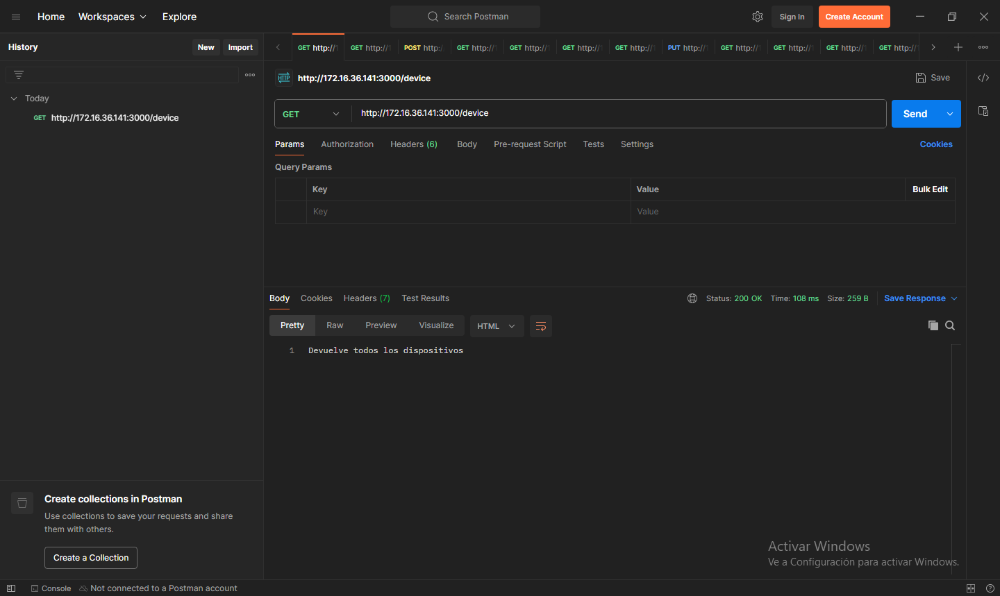

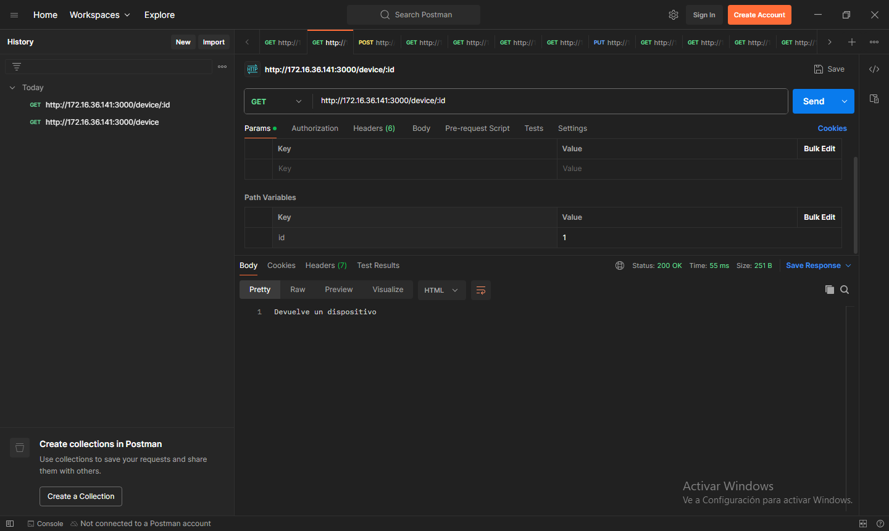

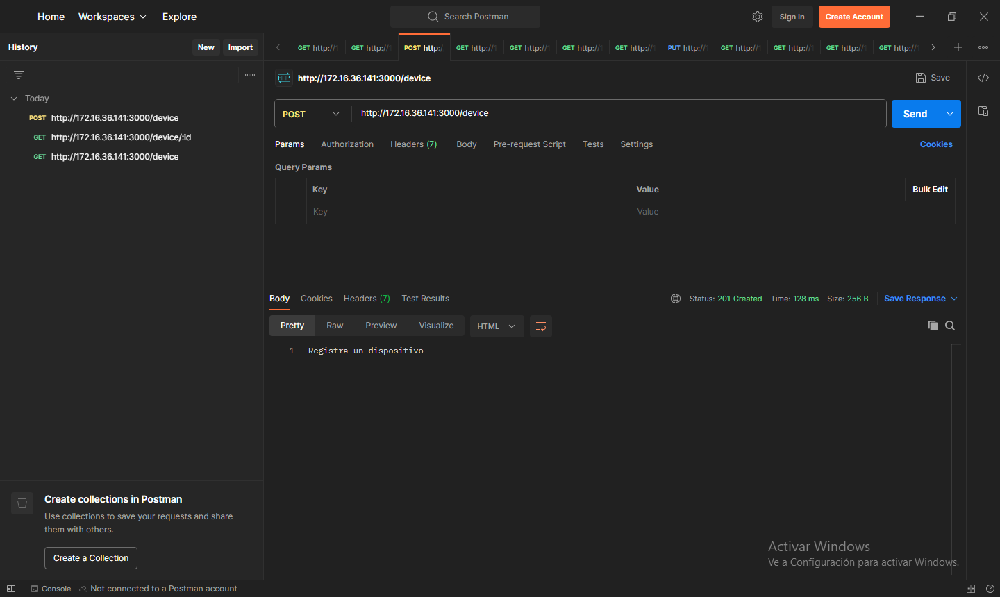

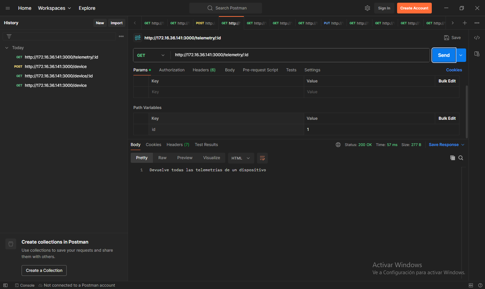

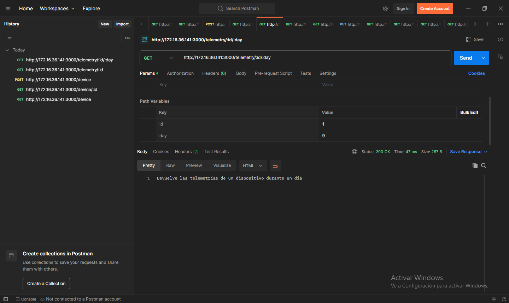

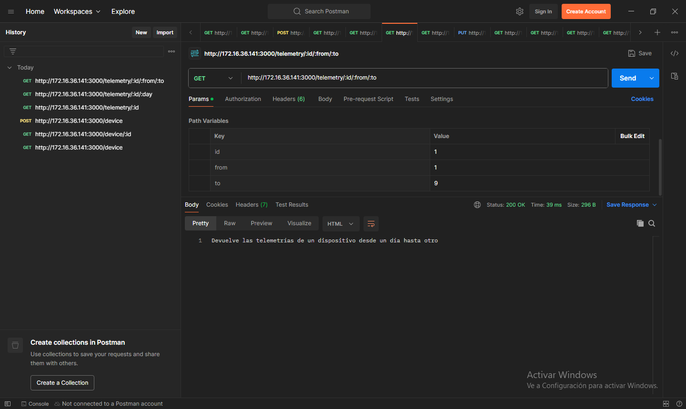

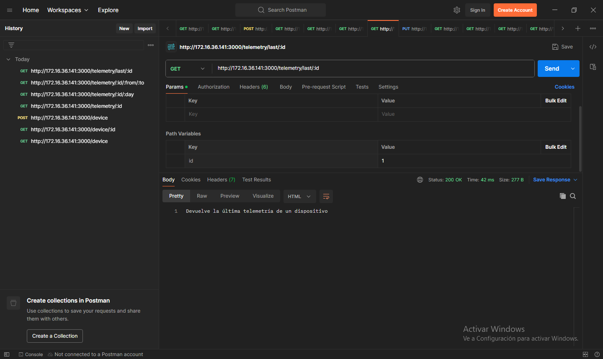

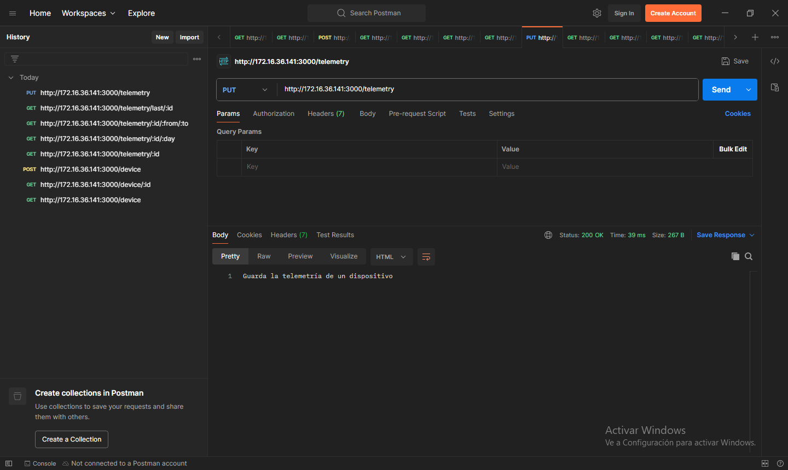

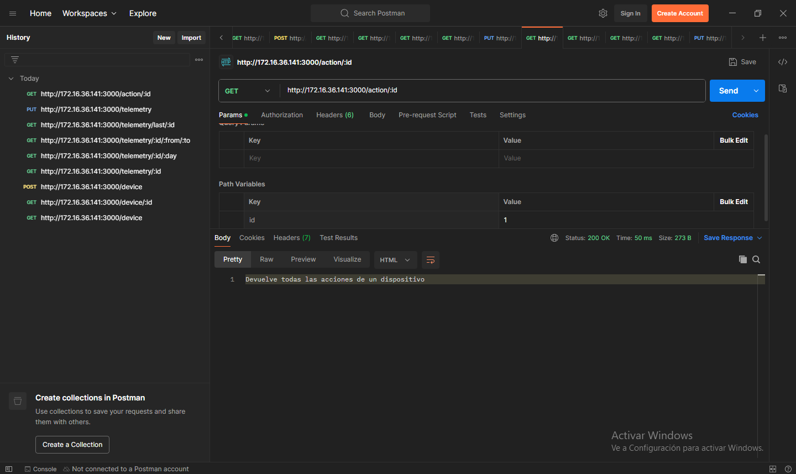

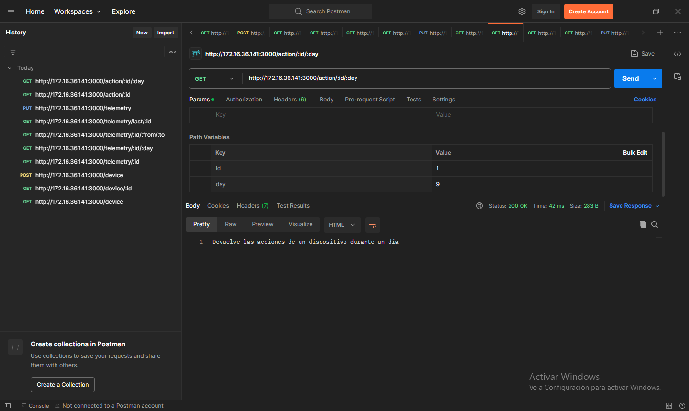

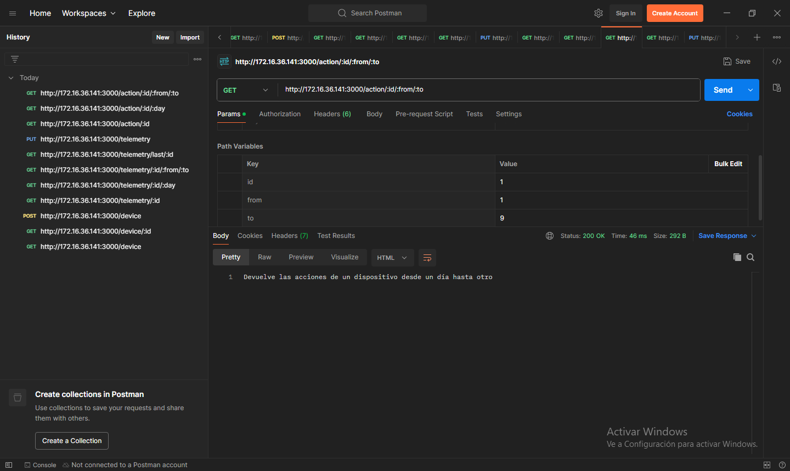

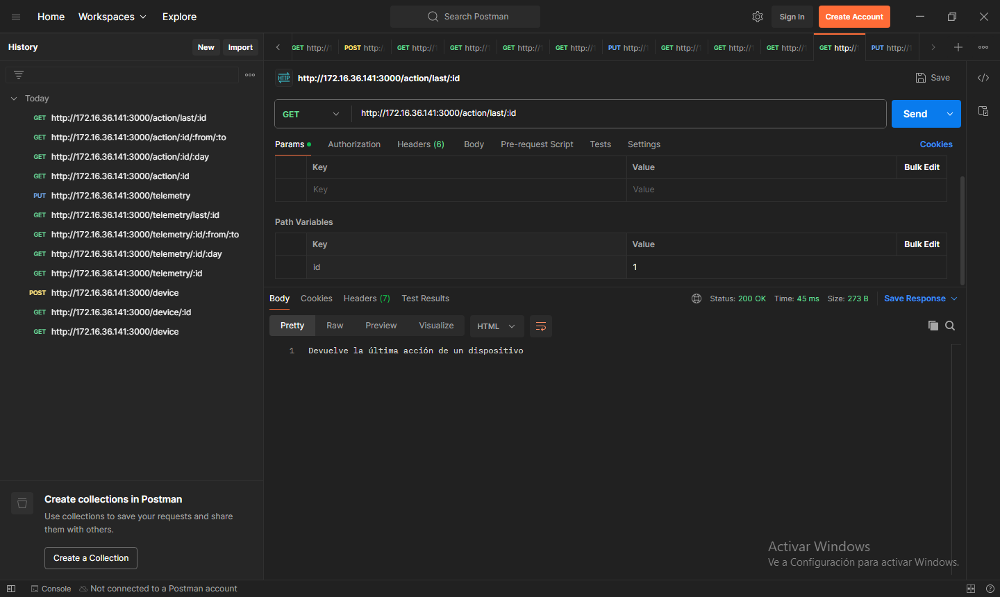

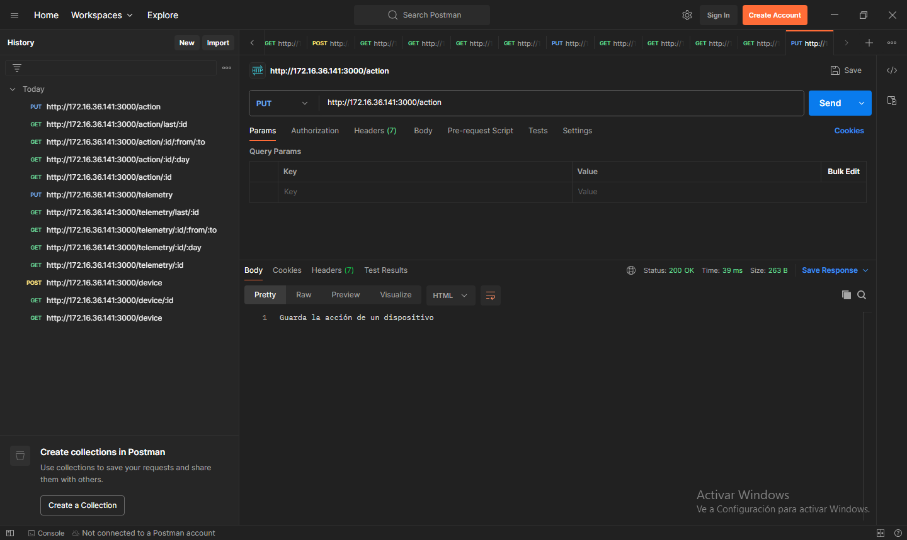

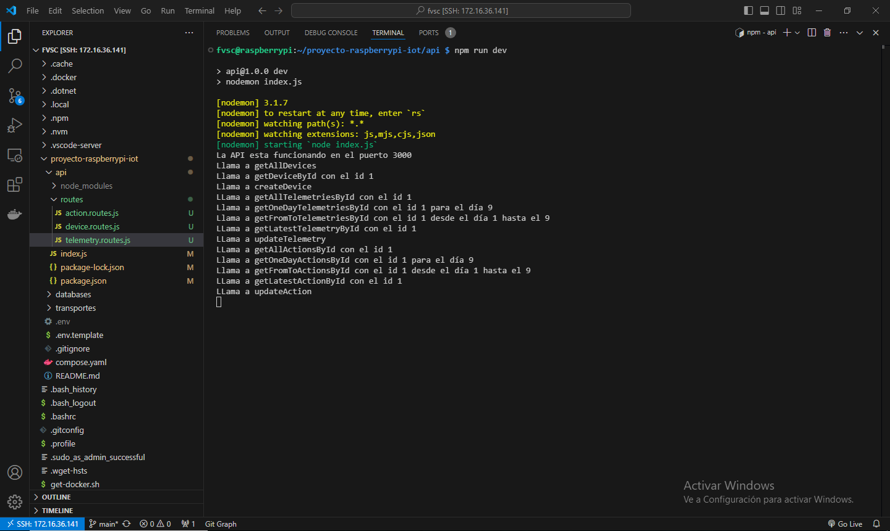
