# Capítulo 15: Postman

## Instalar Postman en nuestra PC

1. Instalar [Postman](https://www.postman.com/downloads/).

## Probar la API REST para MongoDB con Postman y MongoDB Compass

1. Abrir la terminal de la Raspberry Pi desde Visual Studio Code.
2. Ejecutar `cd proyecto-raspberrypi-iot`.
3. Ejecutar `cd api`.
4. Ejecutar Node en modo desarrollo o producción.

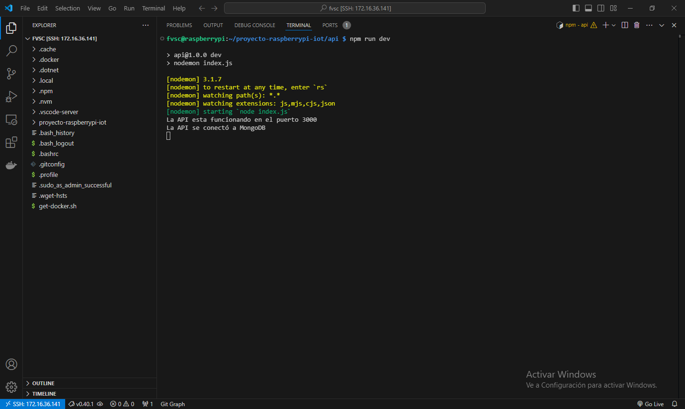

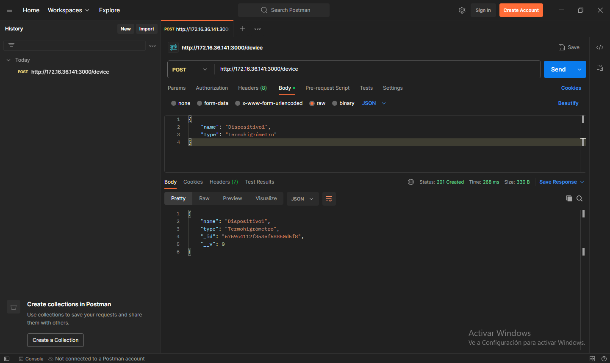

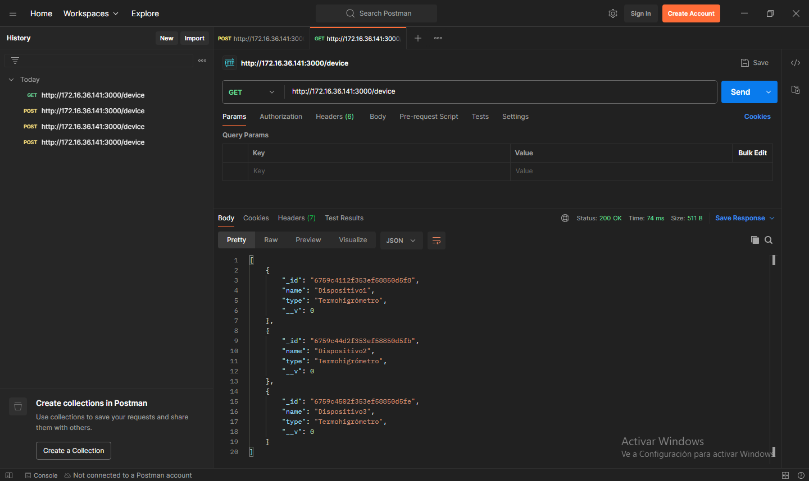

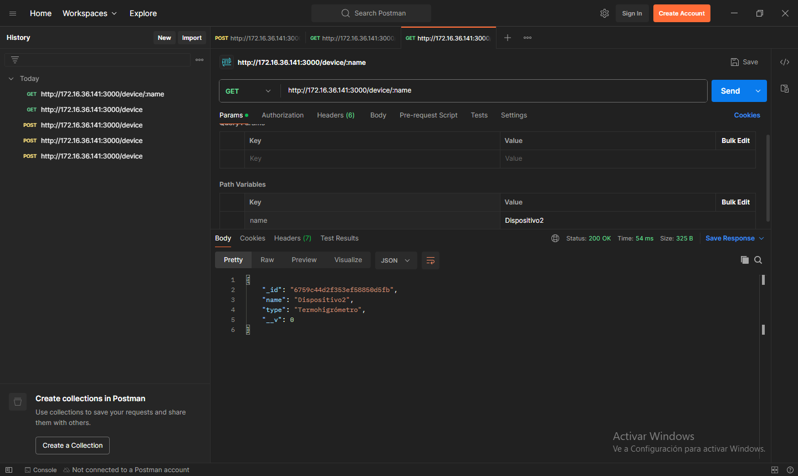

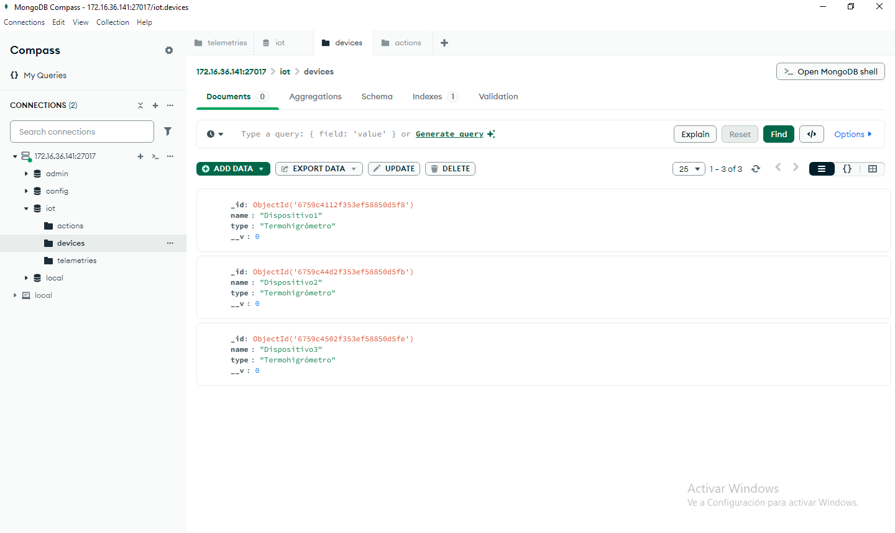

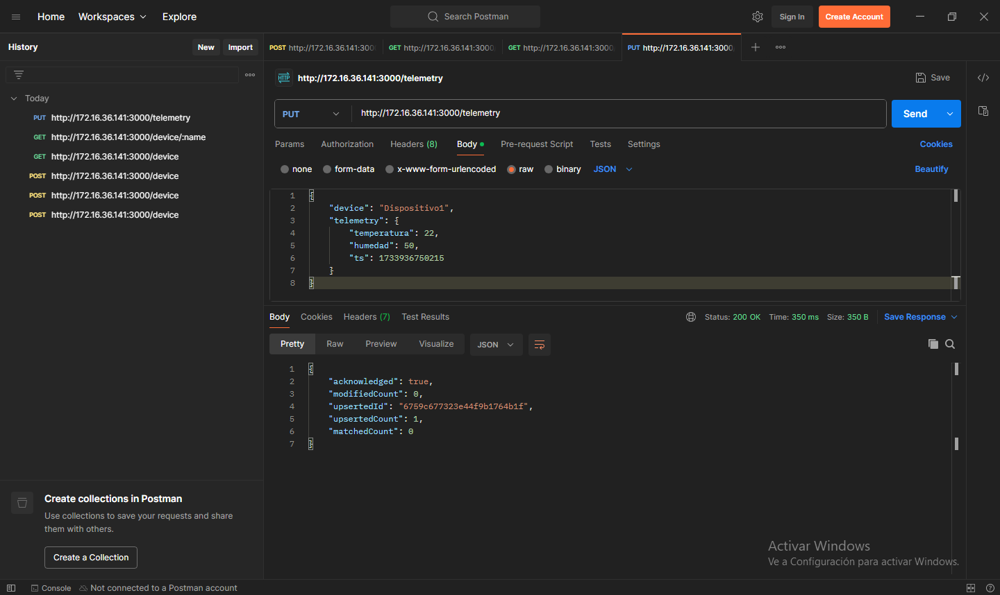

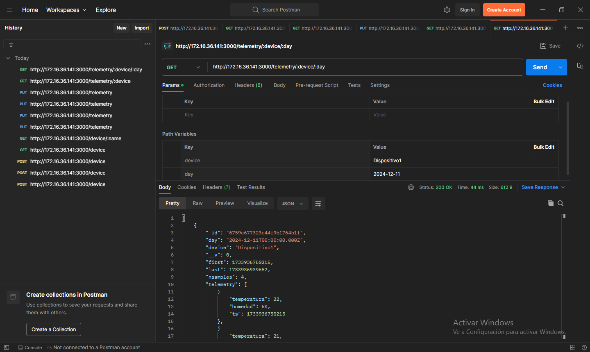

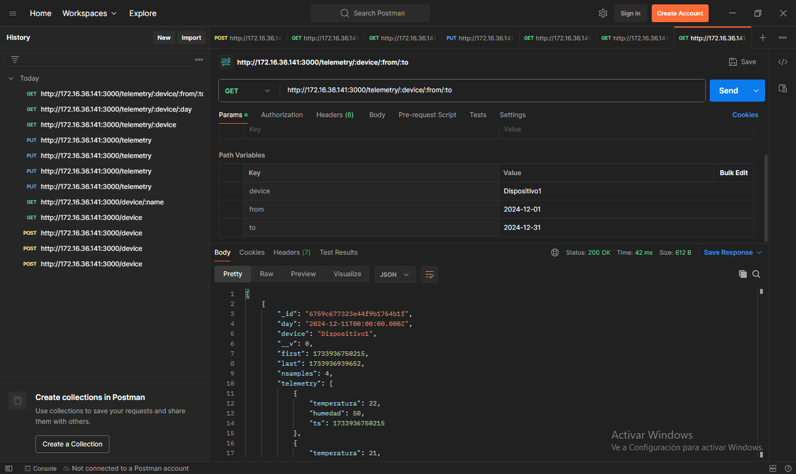

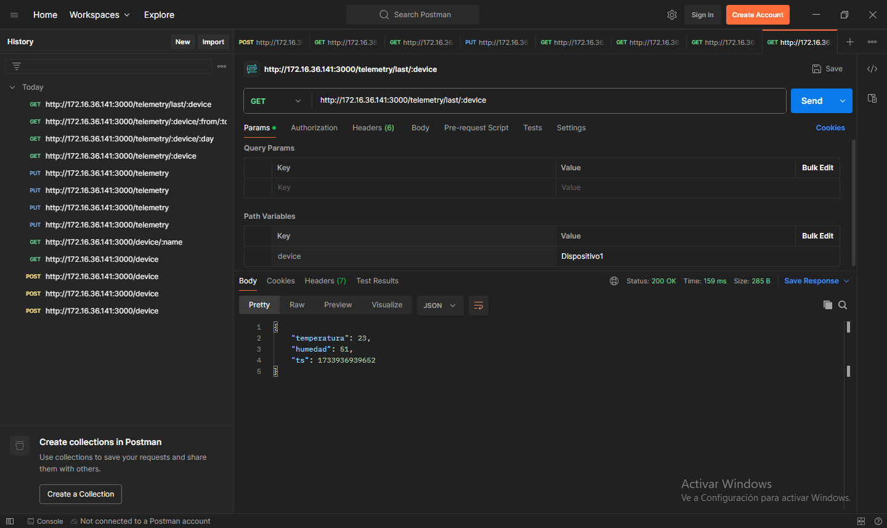

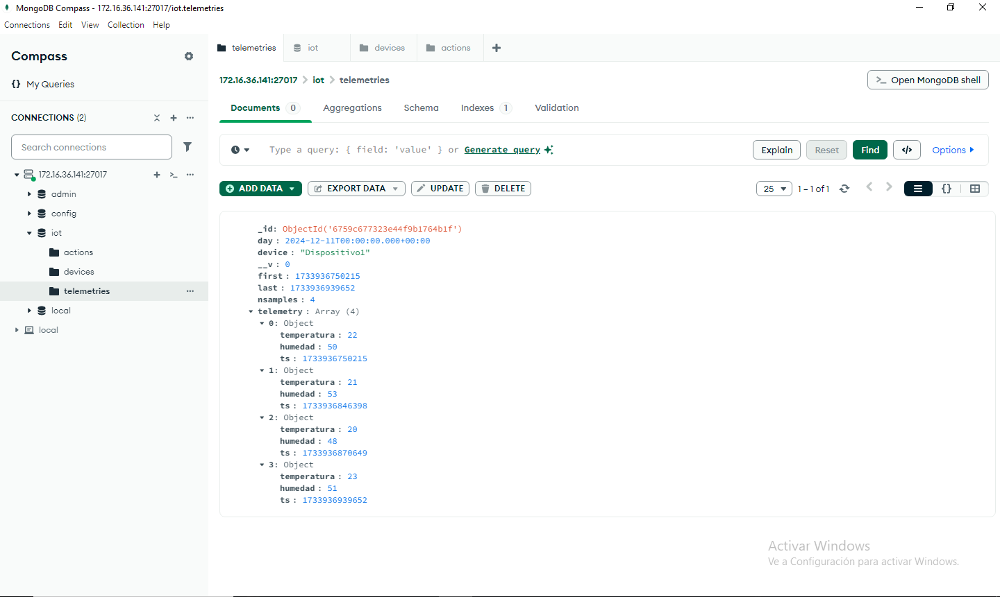

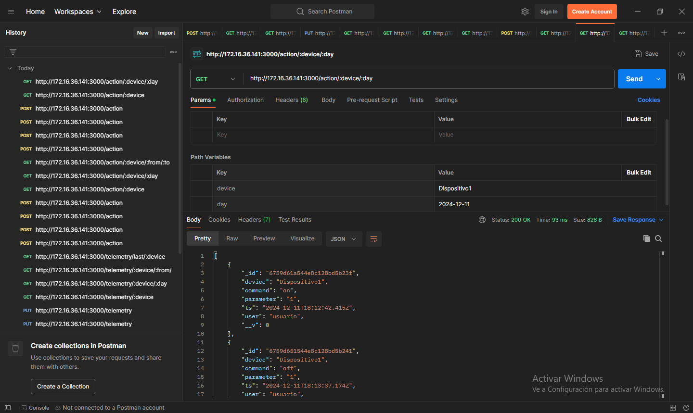

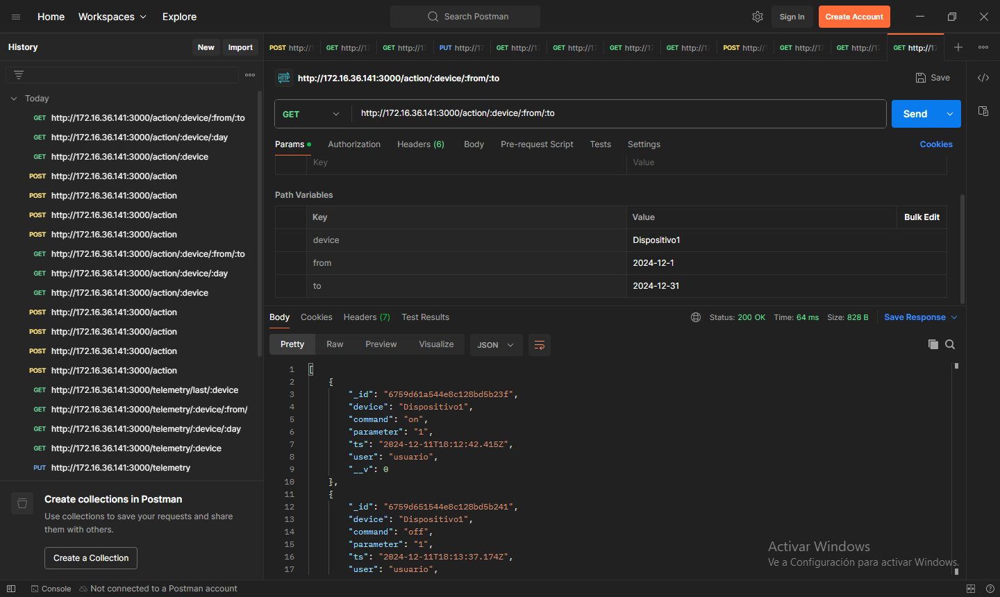

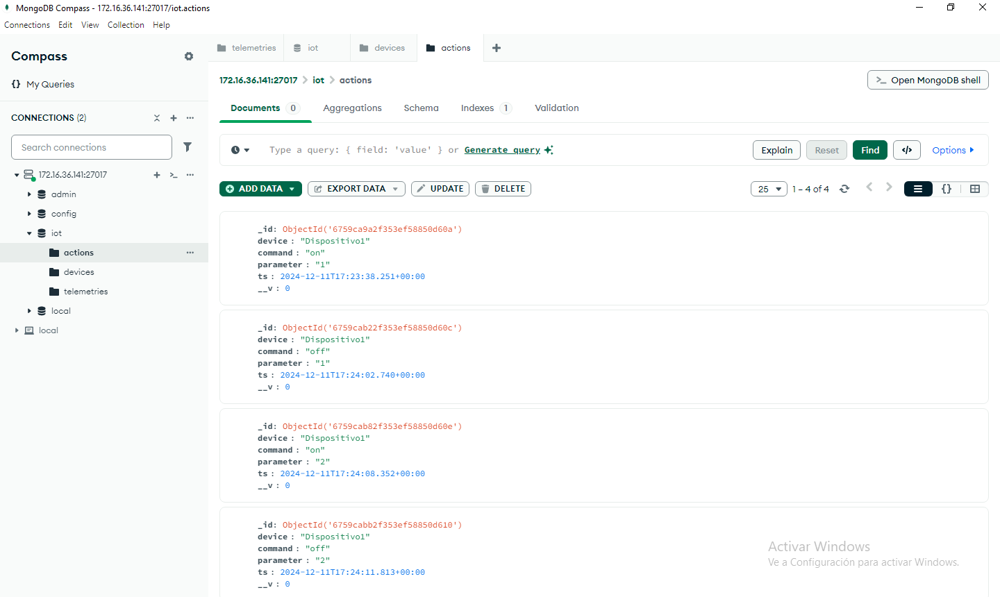
