# Capítulo 2: Raspberry Pi OS

## Formatear la tarjeta microSD

1. Insertar la tarjeta microSD en la PC.
2. Ingresar `cmd` en la barra de busqueda.
3. Clic en `Ejecutar como administrador`.
4. Ejecutar `diskpart`.
5. Ejecutar `list disk`.
6. Ejecutar `select disk X`, siendo X el número que corresponde a la tarjeta microSD.
7. Ejecutar `clean`.

## Instalar el Raspberry Pi OS en la tarjeta microSD

1. Instalar el [Raspberry Pi Imager](https://www.raspberrypi.com/software/).

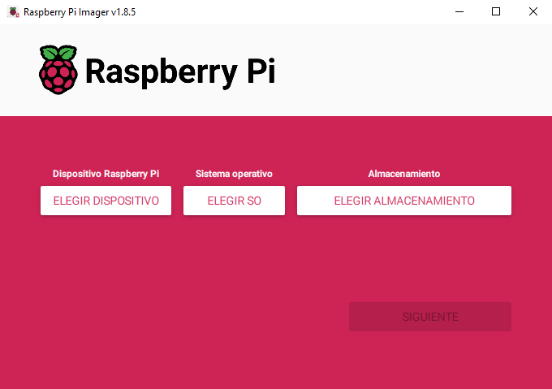

2. Clic en `ELEGIR DISPOSITIVO`.
3. Clic en el modelo de hardware que tenemos.

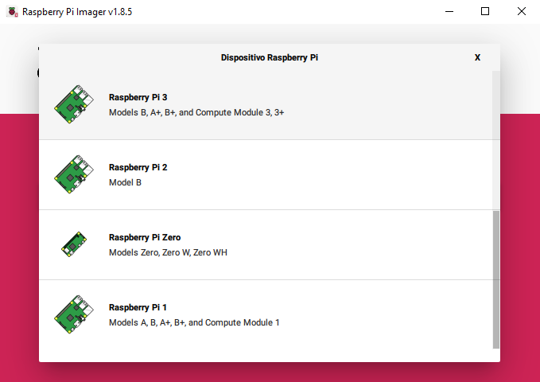

4. Clic en `ELEGIR SO`.
5. Clic en `Raspberry Pi OS (other)`.

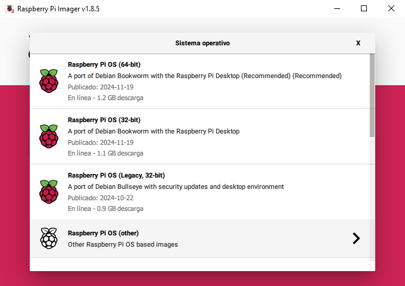.

6. Clic en `Raspberry Pi OS Lite (64-bit)`.

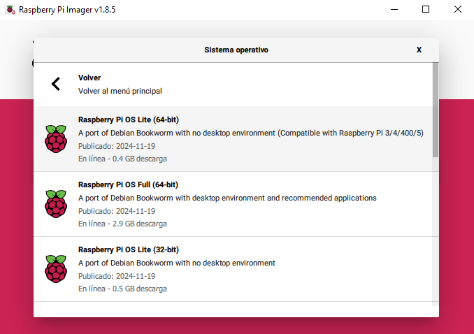

7. Clic en `ELEGIR ALMACENAMIENTO`.
8. Clic en la targeta microSD.

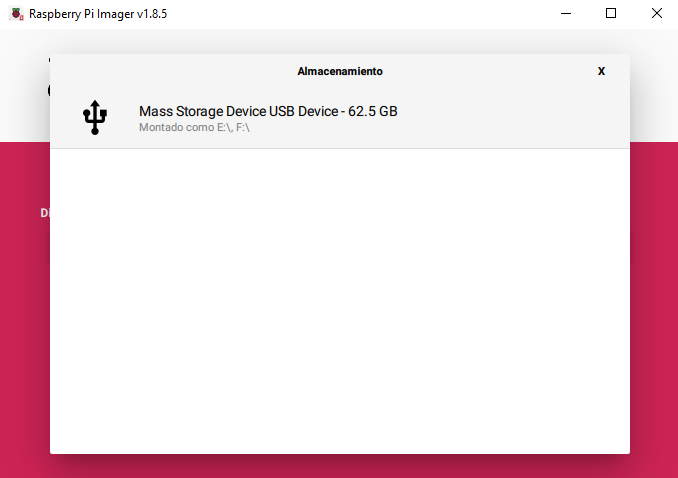

9. Clic en `SIGUIENTE`.

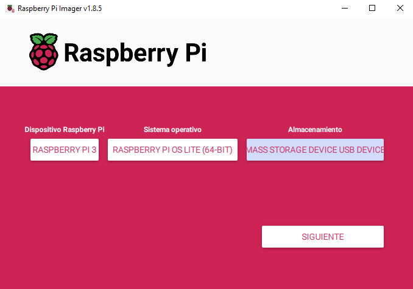

10. Clic en `EDITAR AJUSTES`.

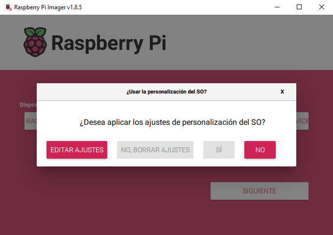

11. Marcar el checkbox `Establecer nombre del anfitrión`.

📝Modificar `raspberrypi` si tenemos más de un hardware.

12. Marcar el checkbox `Establecer nombre de usuario y contraseña`.
13. Ingresar el `Nombre de usuario` para iniciar sesión.
14. Ingresar la `Contraseña` para iniciar sesión.
15. Marcar el checkbox `Configurar LAN inalámbrica`.
16. Ingresar el `SSID` de nuestra red wifi.
17. Ingresar la `Contraseña` de nuestra red wifi.
18. Ingresar `AR` como `País de LAN inalámbrica`.
19. Marcar el checkbox `Establecer ajustes regionales`.
20. Ingresar `America/Buenos_Aires` como `Zona horaria`.
21. Ingresar `latam` como `Distribución del teclado`.
22. Clic en `SERVICIOS`.

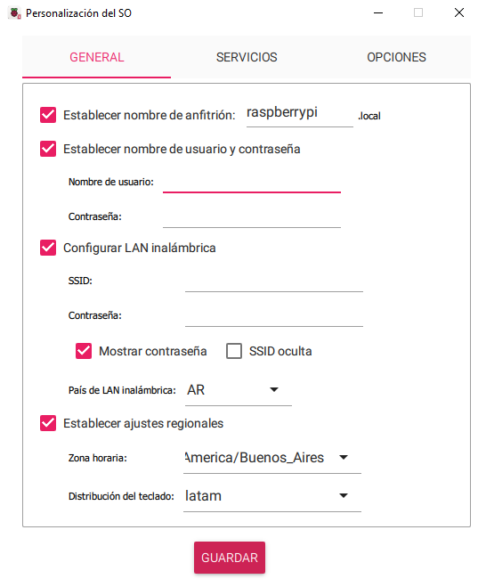

23. Marcar el checkbox `Activa SHH`.
24. Marcar la opción `Usar autenticación por contraseña`.
25. Clic en `GUARDAR`.
26. Clic en `SÍ`.

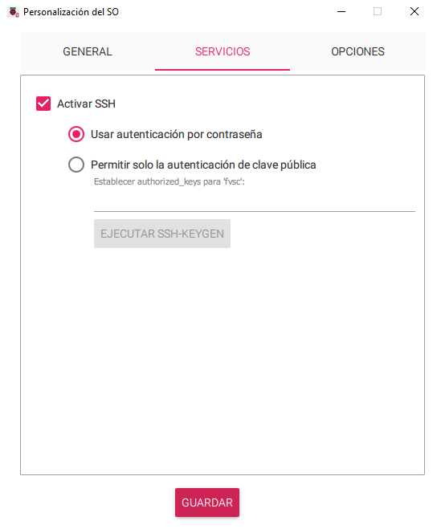

27. Clic en `SÍ`.

28. Esperar a que finalize el proceso de instalación.

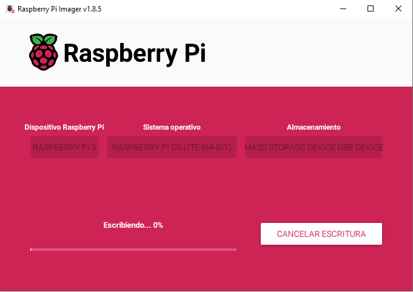

29. Clic en `CONTINUAR`.

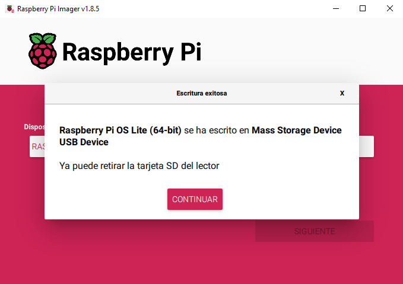

30. Retirar la tarjeta microSD de la PC.
31. Insertar la tarjeta microSD en la Raspberry Pi.
32. Conectar la fuente de alimentación a la Raspberry Pi.

📝[Install an operating system](https://www.raspberrypi.com/documentation/computers/getting-started.html#install-an-operating-system).
