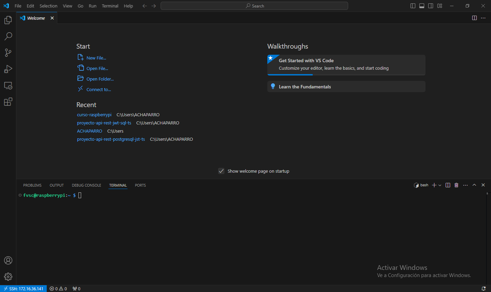
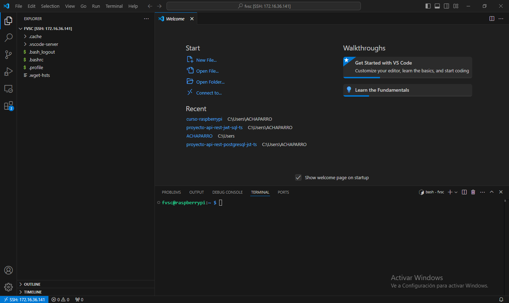

# Capítulo 3: Visual Studio Code

## Instalar Visual Studio Code y sus extensiones en nuestra PC

1. Instalar [Visual Studio Code](https://code.visualstudio.com/Download).
2. Instalar la extensión [Remote - SSH](https://marketplace.visualstudio.com/items?itemName=ms-vscode-remote.remote-ssh).
3. Instalar la extensión [Remote Explorer](https://marketplace.visualstudio.com/items?itemName=ms-vscode.remote-explorer).
4. Instalar la extensión [Git Graph](https://marketplace.visualstudio.com/items?itemName=mhutchie.git-graph).
5. Instalar la extensión [Docker](https://marketplace.visualstudio.com/items?itemName=ms-azuretools.vscode-docker).

📝[Keyboard shortcuts for Windows](https://code.visualstudio.com/shortcuts/keyboard-shortcuts-windows.pdf).

## Obtener la dirección IP de la Raspberry PI

1. Conectarse a la misma red wifi que la Raspberry Pi.
2. Abrir `Visual Studio Code`.
3. Presionar `CTRL+SHIFT+Ñ` para abrir una terminal de Windows.
4. Ejecutar `ping raspberry.local -v 4`.

📝Una dirección IP tiene el formato XXX.XXX.XXX.XXX, done XXX es un número que puede valer entre 0 y 255.

## Crear una conexión a la Raspberry Pi por SSH en Visual Studio Code

1. Presionar `CTRL+SHIFT+P` para abrir la `Command Palette...`.
2. Ingresar `Remote-SSH: Add New SSH Host...`.
3. Ingresar `ssh nombredeusuario@XXX.XXX.XXX.XXX`.
4. Presionar `ENTER`.
5. Presionar `ENTER`.

📝[Access a remote terminal with SSH](https://www.raspberrypi.com/documentation/computers/remote-access.html#ssh).

## Abrir la terminal de la Raspberry Pi desde Visual Studio Code

1. Presionar `CTRL+SHIFT+P` para abrir la `Command Palette...`.
2. Ingresar `Remote-SSH: Connect to Host...`.
3. Seleccionar `XXX.XXX.XXX.XXX`
4. Clic en `Linux`.
5. Clic en `Continue`.
6. Ingresar la contraseña de la Raspberry Pi.
7. Presionar `ENTER`.
8. Presionar `CTRL+SHIFT+Ñ` para abrir la terminal de la Raspberry Pi.

## Ver el sistema de archivos de la Raspberry Pi desde Visual Studio Code

1. Presionar `CTRL+SHIFT+P` para abrir la `Command Palette...`.
2. Seleccionar `File: Open Folder`.
3. Presionar `ENTER`.
4. Clic en `Linux`.
5. Presionar `ENTER`.
6. Ingresar la contraseña de la Raspberry Pi.
7. Presionar `ENTER`.

