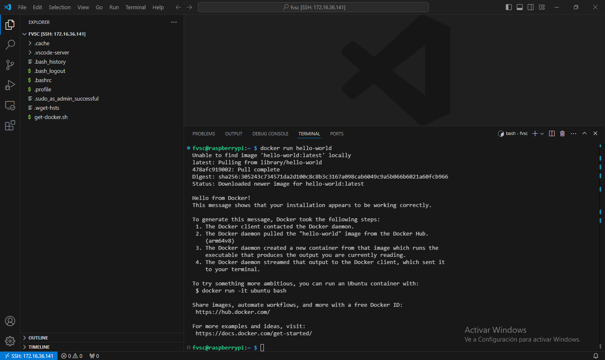
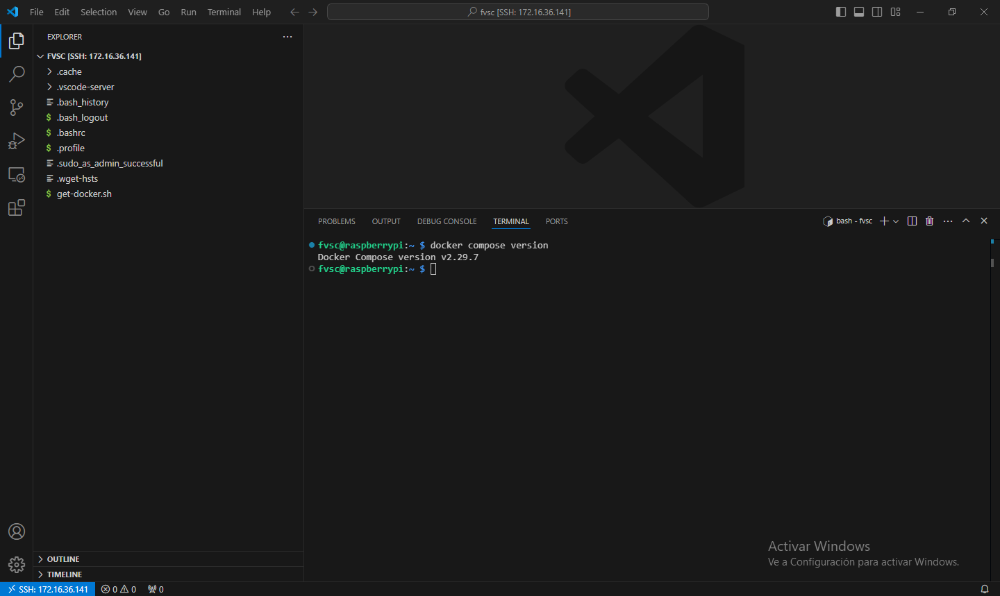

# Capítulo 5: Docker

## Instalar Docker en la Raspberry Pi

1. Ejecutar `curl -fsSL https://get.docker.com -o get-docker.sh`.
2. Ejecutar `sudo sh get-docker.sh`.
3. Ejecutar `sudo groupadd docker`.
4. Ejecutar `sudo usermod -aG docker $USER`.
5. Ejecutar `sudo reboot`.
6. Esperar a que se reinicie la Raspberry Pi.

📝[Install using the convenience script](https://docs.docker.com/engine/install/debian/#install-using-the-convenience-script).

📝[Linux post-installation steps for Docker Engine](https://docs.docker.com/engine/install/linux-postinstall/).

## Verificar el funcionamiento de Docker en la Raspberry Pi

1. Abrir la terminal de la Raspberry Pi por SSH.
2. Ejecutar `docker run hello-world` para verificar que Docker se instaló correctamente.

3. Ejecutar `docker compose version` para verificar que Docker Compose se instaló correctamente.

📝[Docker Compose](https://docs.docker.com/compose/).

📝[CLI Cheat Sheet](https://docs.docker.com/get-started/docker_cheatsheet.pdf).
