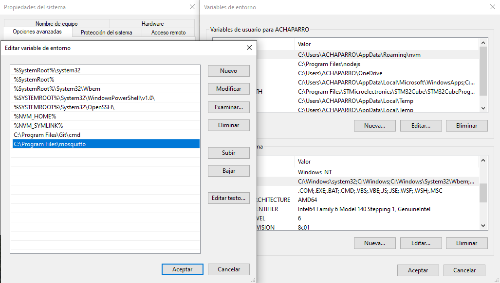
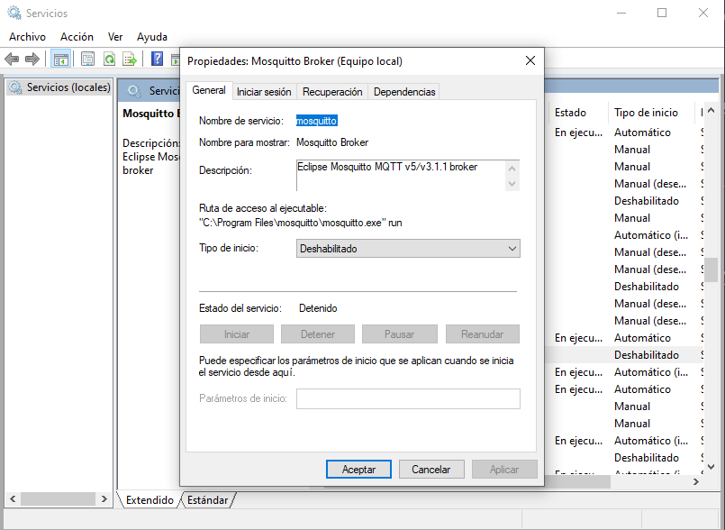
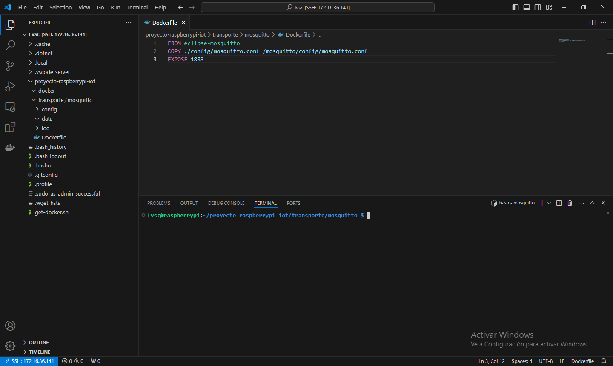
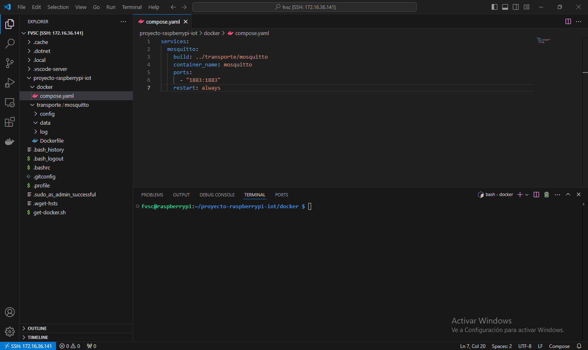
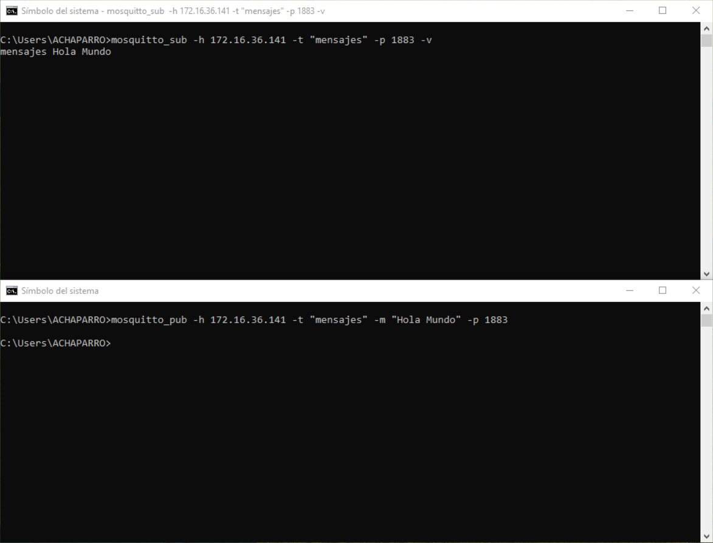

# Capítulo 6: Mosquitto MQTT broker

## Instalar las herramientas de Mosquitto en la PC

1. Instalar [Mosquitto Broker](https://mosquitto.org/download/).
2. Ingresar a las variables de entorno de Windows.
3. Ingresar a la variable del sistema llamada `Path`.
4. Agregar `C:\Program Files\mosquitto`.

5. Ingresar a los servicios de Windows.
6. Ingresar a las propiedades del servicio llamado `Mosquitto Broker`.
7. Clic en `Detener`.
8. Seleccionar `Deshabilitado` en `Tipo de inicio`.
9. Clic en `Aceptar`.

📝[Mosquitto Documentation](https://mosquitto.org/documentation/).

## Crear la estructura de carpetas para Mosquitto y Docker en la Raspberry Pi

1. Ejecutar `mkdir proyecto-raspberrypi-iot`.
2. Ejecutar `cd proyecto-raspberrypi-iot`.
3. Ejecutar `mkdir docker`.
4. Ejecutar `mkdir transports`.
5. Ejecutar `cd transports`.
6. Ejecutar `mkdir mosquitto`.
7. Ejecutar `cd mosquitto`.
8. Ejecutar `mkdir config`.
9. Ejecutar `mkdir data`.
10. Ejecutar `mkdir log`.

📦[eclipse-mosquitto](https://hub.docker.com/_/eclipse-mosquitto).

## Crear el archivo mosquitto.conf de Mosquitto en la Raspberry Pi

1. Ejecutar `cd config`.
2. Ejecutar `wget https://raw.githubusercontent.com/eclipse-mosquitto/mosquitto/master/mosquitto.conf`.
3. Abrir el archivo descargado.
4. Descomentar la línea 234.
5. Modificar su contenido a `listener 1883`.
6. Descomentar la línea 428.
7. Modificar su contenido a `persistence true`.
8. Descomentar la línea 438.
9. Modificar su contenido a `persistence_location /mosquitto/data/`.
10. Descomentar la línea 471.
11. Modificar su contenido a `log_dest file /mosquitto/log/mosquitto.log`.
12. Descomentar la línea 482.
13. Modificar su contenido a `log_type all`.
14. Descomentar la línea 532.
15. Modificar su contenido a `allow_anonymous true`.

📝[mosquitto.conf man page](https://mosquitto.org/man/mosquitto-conf-5.html).

## Crear el archivo Dockerfile de Moquitto en la Raspberry Pi

1. Ejecutar `cd ..`.
2. Ejecutar `touch Dockerfile`.
3. Modificar el contenido del `Dockerfile`:

📝[Dockerfile overview](https://docs.docker.com/build/concepts/dockerfile/).

📝[Dockerfile reference](https://docs.docker.com/reference/dockerfile/).

## Crear el archivo compose.yaml de Docker en la Raspberry Pi

1. Ejecutar `cd ..`.
2. Ejecutar `cd ..`.
3. Ejecutar `cd docker`.
4. Ejecutar `touch compose.yaml`.
5. Modificar el contenido del `compose.yaml`:

📝[Docker Compose](https://docs.docker.com/compose/).

## Crear y arrancar el contenedor de Mosquitto en la Raspberry Pi

1. Ejecutar `docker compose up -d` para crear y arrancar los contenedores de Docker en segundo plano.

## Subscribirse y publicar un mensaje al topic llamado mensajes desde la PC

1. Abrir una terminal.
2. Ejecutar `mosquitto_sub -d -q 1 -h "XXX.XXX.XXX.XXX" -p "1883" -t "v1/devices/me/telemetry"`. Donde `XXX.XXX.XXX.XXX` es la dirección IP de la Raspberry Pi.
3. Abrir una terminal.
4. Ejecutar `mosquitto_pub -d -q 1 -h "XXX.XXX.XXX.XXX" -p "1883" -t "v1/devices/me/telemetry" -m {"temperature":25}`. Donde `XXX.XXX.XXX.XXX` es la dirección IP de la Raspberry Pi.

📝[mosquitto_sub man page](https://mosquitto.org/man/mosquitto_sub-1.html).

📝[mosquitto_pub man page](https://mosquitto.org/man/mosquitto_pub-1.html).

## Detener el contenedor de Mosquitto en la Raspberry Pi

1. Ejecutar `docker compose stop` para detener los contenedores de Docker.
