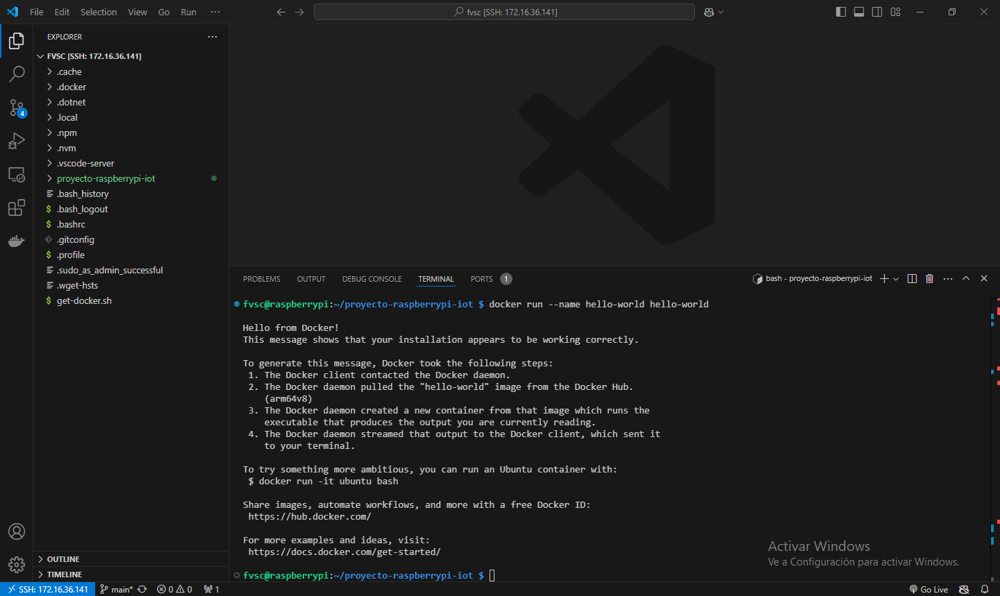
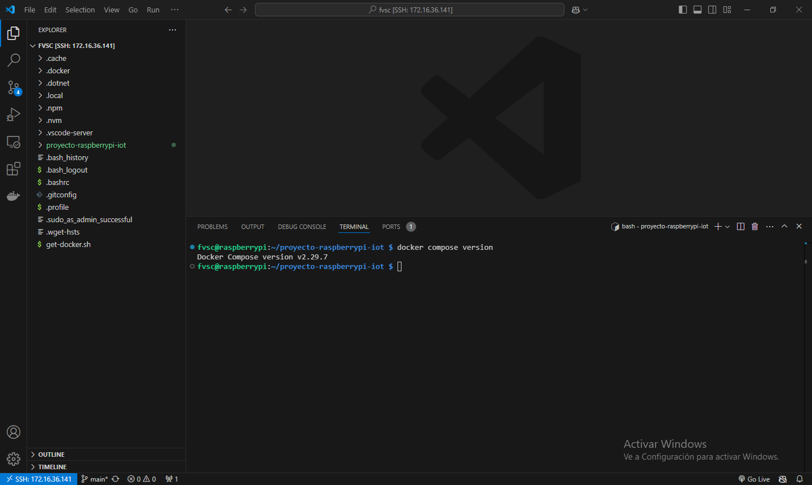

# Capítulo 7: Docker en la Raspberry Pi

## Instalar Docker

1. Abrir la terminal de la Raspberry Pi desde Visual Studio Code.
2. Ejecutar `curl -fsSL https://get.docker.com -o get-docker.sh`.
3. Ejecutar `sudo sh get-docker.sh`.
4. Ejecutar `sudo groupadd docker`.
5. Ejecutar `sudo usermod -aG docker $USER`.
6. Ejecutar `sudo reboot`.
7. Esperar a que se reinicie la Raspberry Pi.

📝[Install using the convenience script](https://docs.docker.com/engine/install/debian/#install-using-the-convenience-script).

📝[Linux post-installation steps for Docker Engine](https://docs.docker.com/engine/install/linux-postinstall/).

## Probar el funcionamiento de Docker

1. Ejecutar `docker run --name hello-world hello-world`.

2. Ejecutar `docker rm hello-world`.
3. Ejecutar `docker rmi hello-world`.
4. Ejecutar `docker compose version`.

📝[Docker Compose](https://docs.docker.com/compose/).

📝[CLI Cheat Sheet](https://docs.docker.com/get-started/docker_cheatsheet.pdf).
