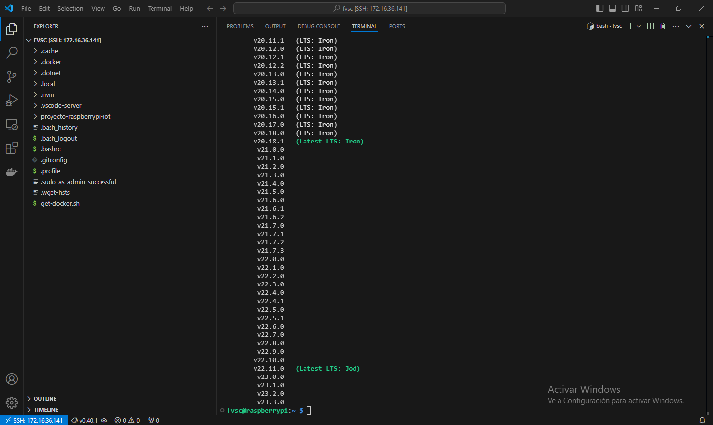

# Capítulo 7: nvm y nodejs

## Instalar nvm en la Raspberry Pi

1. Abrir la terminal de la Raspberry Pi por SSH.
2. Ejecutar `curl -o- https://raw.githubusercontent.com/nvm-sh/nvm/v0.40.1/install.sh | bash`.
3. Cerrar la terminal.
4. Volver a abrir la terminal de la Raspberry Pi por SSH.
5. Ejecutar `nvm ls-remote` para ver las versiones de nodejs disponibles.

📝[nvm](https://github.com/nvm-sh/nvm).

## Instalar y utilizar la última versión LTS de nodejs en la Raspberry Pi

1. Ejecutar `nvm install 22.11.0`.
2. Ejecutar `nvm use 22.11.0`.
3. Ejecutar `node -v`.

📝La versión 22.11.0 fue obtenida con el comando `nvm ls-remote`.

## Crear un proyecto de nodejs en la Raspberry Pi

1. Ejecutar `cd proyecto-raspberrypi-iot`.
2. Ejecutar `mkdir core`.
3. Ejecutar `cd core`.
4. Ejecutar `npm init`.
5. No modificar el `package name` y presionar `ENTER`.
6. No modificar la `version` y presionar `ENTER`.
7. Ingresar `Gestión de ingreso de telemetrías (TIM) y llamadas a procedimientos remotos (RPC)` como `description` y presionar `ENTER`.
8. Ingresar `src/app.js` el `entry point` y presionar `ENTER`.
9. No modificar el `test command` y presionar `ENTER`.
10. No modificar el `git repository` y presionar `ENTER`.
11. No modificar las `keywords` y presionar `ENTER`.
12. Ingresar `Ing. Andrés Chaparro` como `author`y presionar `ENTER`.
13. No modificar la `license` y presionar `ENTER`.
14. Ingresar `yes ` y presionar `ENTER`.

Como resultado, se crea el archivo `package.json`.

## Instalación de dependencias para desarrollo con nodejs

1. Ejecutar `npm install --save-dev nodemon`.

📝[nodemon](https://www.npmjs.com/package/nodemon)

## Instalación de dependencias para producción con nodejs

1. Ejecutar `npm install express`.
2. Ejecutar `npm install body-parser`.
3. Ejecutar `npm install mqtt --save`.
4. Ejecutar `npm install dotenv --save`.

📝[express](https://www.npmjs.com/package/express)

📝[body-parser](https://www.npmjs.com/package/body-parser)

📝[mqtt](https://www.npmjs.com/package/mqtt)

📝[dotenv](https://www.npmjs.com/package/dotenv)

## Crear el entry point para el proyecto de nodejs

1. Ejecutar `mkdir src`.
2. Ejecutar `cd src`.
3. Ejecutar `touch app.js`.
4. Agregar una línea al archivo `app.js` con la sentencia `console.log('Hola Mundo')`.

## Editar los scripts del archivo package.json

1. Eliminar el script llamado `test`.
2. Agregar un script llamado `start` que ejecute `node src/app.js`.
3. Agregar un script llamado `dev` que ejecute `nodemon src/app.js`.
4. Ejecutar `npm start`.
5. Ejecutar `npm run dev`.

