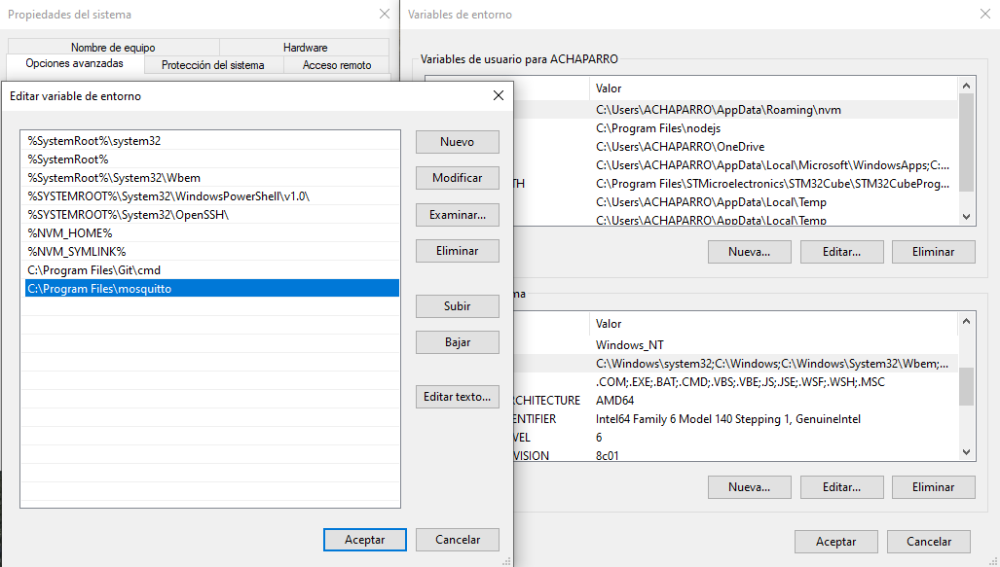
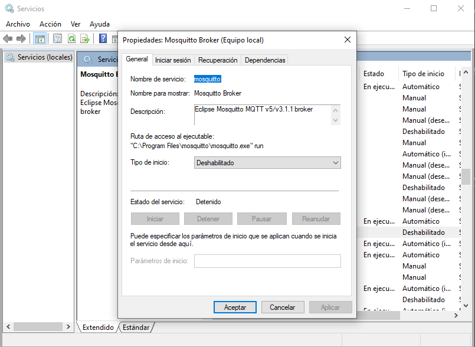
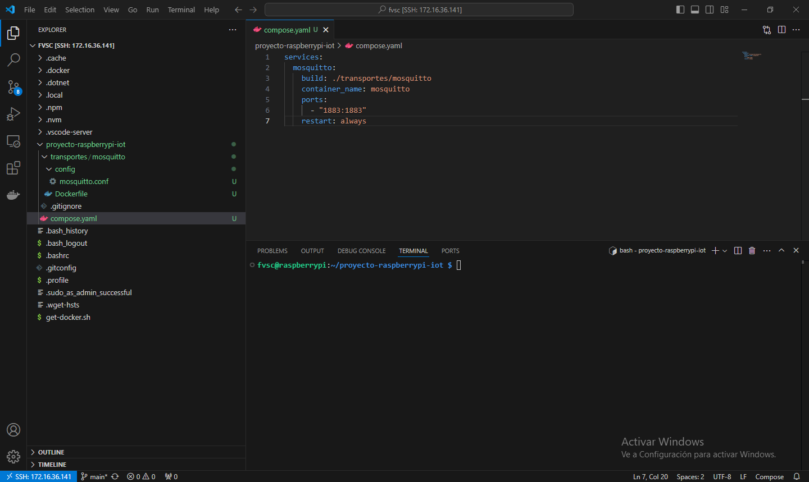
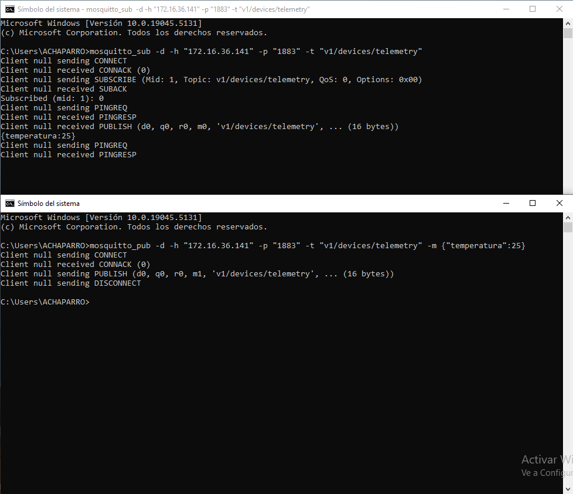

# Capítulo 8: Mosquitto MQTT broker con Docker en la Raspberry Pi

## Instalar las herramientas de Mosquitto en nuestra PC

1. Instalar [Mosquitto Broker](https://mosquitto.org/download/).
2. Abrir las variables de entorno de Windows.
3. Abrir la variable del sistema llamada `Path`.
4. Agregar `C:\Program Files\mosquitto`.

5. Ver los servicios de Windows.
6. Ingresar a las propiedades del servicio llamado `Mosquitto Broker`.
7. Clic en `Detener`.
8. Seleccionar `Deshabilitado` en `Tipo de inicio`.
9. Clic en `Aceptar`.

📝[Mosquitto Documentation](https://mosquitto.org/documentation/).

## Crear el archivo mosquitto.conf

1. Abrir la terminal de la Raspberry Pi desde Visual Studio Code.
2. Ejecutar `mkdir proyecto-raspberrypi-iot`.
3. Ejecutar `cd proyecto-raspberrypi-iot`.
4. Ejecutar `mkdir transportes`.
5. Ejecutar `cd transportes`.
6. Ejecutar `mkdir mosquitto`.
7. Ejecutar `cd mosquitto`.
8. Ejecutar `mkdir config`.
9. Ejecutar `cd config`.
10. Ejecutar `wget https://raw.githubusercontent.com/eclipse-mosquitto/mosquitto/master/mosquitto.conf`.
11. Ver el sistema de archivos de la Raspberry Pi desde Visual Studio Code.
12. Abrir el archivo `mosquitto.conf`.
13. Descomentar la línea 234.
14. Modificar su contenido a `listener 1883`.
15. Descomentar la línea 532.
16. Modificar su contenido a `allow_anonymous true`.

📝[mosquitto.conf man page](https://mosquitto.org/man/mosquitto-conf-5.html).

## Crear el archivo Dockerfile para Mosquitto

1. Ejecutar `cd ..`.
2. Ejecutar `touch Dockerfile`.
3. Modificar el contenido del `Dockerfile`:

📝[Dockerfile overview](https://docs.docker.com/build/concepts/dockerfile/).

📝[Dockerfile reference](https://docs.docker.com/reference/dockerfile/).

📦[eclipse-mosquitto](https://hub.docker.com/_/eclipse-mosquitto).

## Crear el archivo compose.yaml de Docker

1. Ejecutar `cd ..`.
2. Ejecutar `cd ..`.
3. Ejecutar `touch compose.yaml`.
4. Modificar el contenido del `compose.yaml`:

📝[Docker Compose](https://docs.docker.com/compose/).

## Crear y arrancar los contenedores de Docker en segundo plano

1. Ejecutar `docker compose up -d`.

## Subscribirse a un topic y publicar mensajes desde nuestra PC

1. Abrir una terminal de Windows.
2. Ejecutar `mosquitto_sub -d -h "XXX.XXX.XXX.XXX" -p "1883" -t "v1/devices/telemetry"`. Donde `XXX.XXX.XXX.XXX` es la dirección IP de la Raspberry Pi.
3. Abrir una terminal de Windows.
4. Ejecutar `mosquitto_pub -d -h "XXX.XXX.XXX.XXX" -p "1883" -t "v1/devices/telemetry" -m {"temperatura":25}`. Donde `XXX.XXX.XXX.XXX` es la dirección IP de la Raspberry Pi.

📝[mosquitto_sub man page](https://mosquitto.org/man/mosquitto_sub-1.html).

📝[mosquitto_pub man page](https://mosquitto.org/man/mosquitto_pub-1.html).

## Detener los contenedores de Docker

1. Ejecutar `docker compose stop`.
