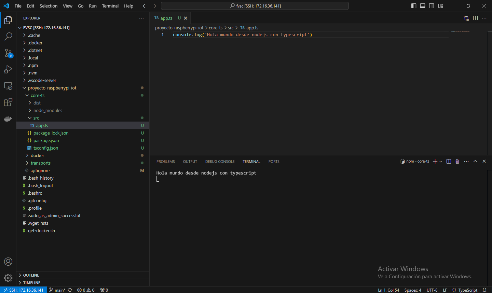
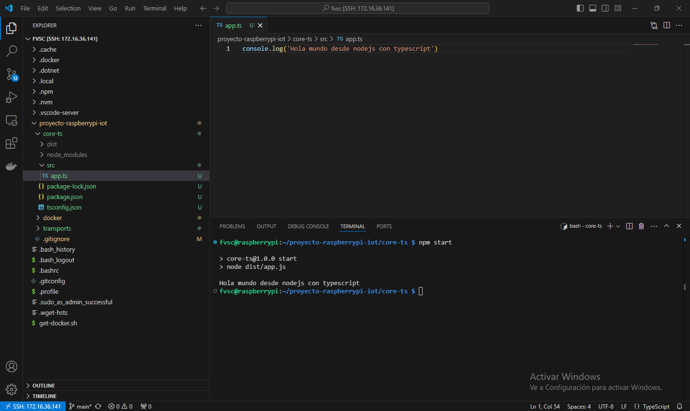

# Capítulo 8: Proyecto de nodejs con typescript

## Crear el archivo package.json de nodejs en la Raspberry Pi

1. Ejecutar `cd ..`.
2. Ejecutar `mkdir core-ts`.
3. Ejecutar `cd core-ts`.
4. Ejecutar `npm init`.
5. No modificar el `package name` y presionar `ENTER`.
6. No modificar la `version` y presionar `ENTER`.
7. Ingresar `Gestión de ingreso de telemetrías (TIM) y llamadas a procedimientos remotos (RPC) con TypeScript` como `description` y presionar `ENTER`.
8. Ingresar `src/app.js` como `entry point` y presionar `ENTER`.
9. No modificar el `test command` y presionar `ENTER`.
10. No modificar el `git repository` y presionar `ENTER`.
11. No modificar las `keywords` y presionar `ENTER`.
12. Ingresar nuestro nombre como `author`y presionar `ENTER`.
13. No modificar la `license` y presionar `ENTER`.
14. Ingresar `yes ` y presionar `ENTER`.

## Instalar las dependencias para desarrollo de nodejs en la Raspberry Pi

1. Ejecutar `npm i -D typescript`.
2. Ejecutar `npm i -D @types/node`.
3. Ejecutar `npm i -D ts-node-dev`.
4. Ejecutar `npm i -D @types/express`.
5. Ejecutar `npm i -D @types/body-parser`.
6. Ejecutar `npm i -D rimraf`.

📝[typescript](https://www.npmjs.com/package/typescript).

📝[@types/node](https://www.npmjs.com/package/@types/node).

📝[ts-node-dev](https://www.npmjs.com/package/ts-node-dev).

📝[express](https://www.npmjs.com/package/express).

📝[body-parser](https://www.npmjs.com/package/body-parser).

📝[rimraf](https://www.npmjs.com/package/rimraf).

## Instalar las dependencias para producción de nodejs en la Raspberry Pi

1. Ejecutar `npm i express`.
2. Ejecutar `npm i body-parser`.
3. Ejecutar `npm i dotenv`.
4. Ejecutar `npm i mqtt`.

📝[dotenv](https://www.npmjs.com/package/dotenv).

📝[mqtt](https://www.npmjs.com/package/mqtt).

## Crear el archivo tsconfig.json de typescript en la Raspberry Pi

1. Ejecutar `npx tsc --init --outDir dist --rootDir src`.
2. Agregar a `tsconfig.json`:

```
  "exclude": [
    "node_modules",
    "dist"
  ],
  "include": [
    "src"
  ],
```

## Crear los scripts de nodejs en el archivo package.json en la Raspberry Pi

1. Eliminar el script llamado `test`.
2. Agregar los siguientes scripts:

```
  "scripts": {
    "dev": "tsnd --respawn --clear src/app.ts",
    "build": "rimraf ./dist && tsc",
    "start": "node dist/app.js"
  },
```


## Crear en archivo raíz de typecript en la Raspberry Pi

1. Ejecutar `mkdir src`.
2. Ejecutar `cd src`.
3. Ejecutar `touch app.ts`.
4. Modificar el contenido del archivo `app.ts`:

```
console.log('Hola mundo desde nodejs con typescript')
```

## Ejecutar el proyecto en modo de desarollo en la Raspberry Pi

1. Ejecutar `npm run dev`.



## Generar los archivos de producción y correr el proyecto en la Raspberry Pi

1. Ejecutar `npm run build`.
2. Ejecutar `npm start`.

