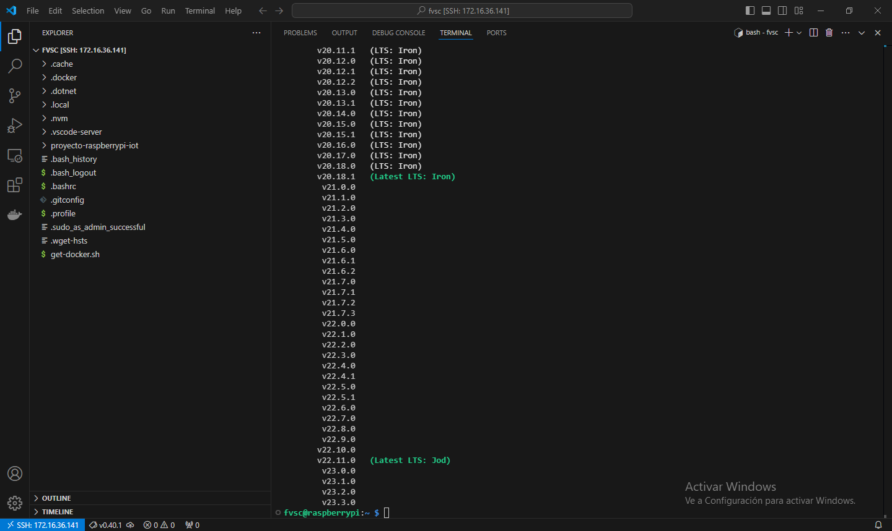
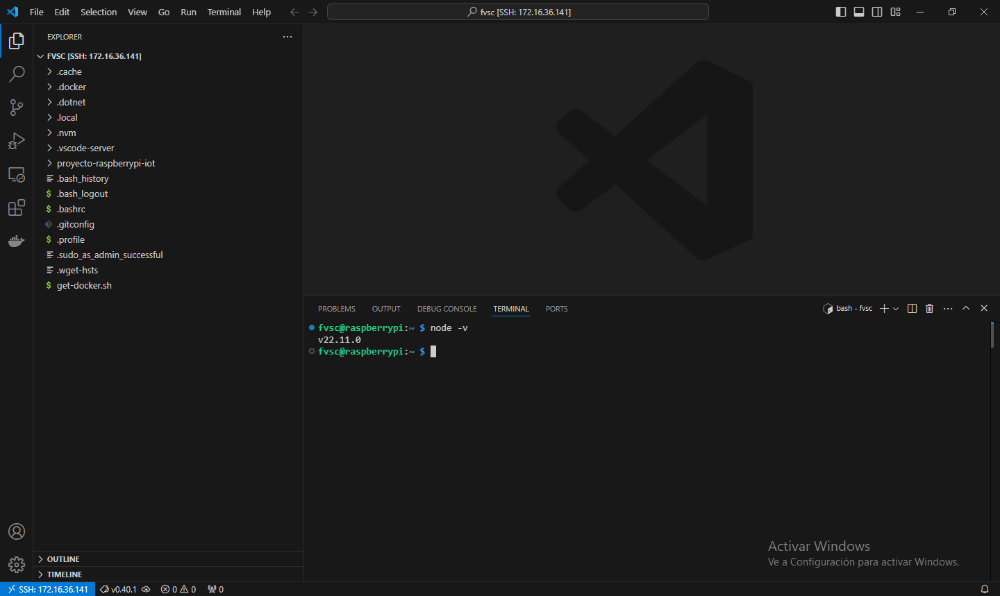

# Capítulo 9: nvm y nodejs en la Raspberry Pi

## Instalar nvm

1. Abrir la terminal de la Raspberry Pi desde Visual Studio Code.
2. Ejecutar `curl -o- https://raw.githubusercontent.com/nvm-sh/nvm/v0.40.1/install.sh | bash`.
3. Cerrar la terminal.
4. Abrir una nueva terminal.
5. Ejecutar `nvm ls-remote` para ver las versiones de nodejs disponibles.

📝[nvm](https://github.com/nvm-sh/nvm).

## Instalar la última versión LTS de nodejs con nvm

1. Ejecutar `nvm install 22.11.0`.
2. Ejecutar `nvm use 22.11.0`.
3. Ejecutar `node -v`.

